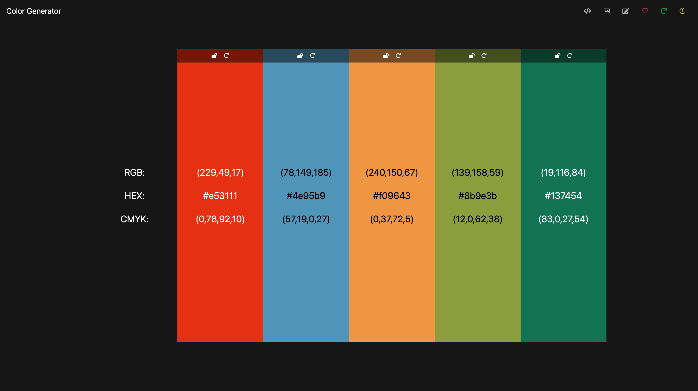

# Color Generator

This app generates 5 random colors using RGB, hex, and CMYK formats. A new palette can be generated using the refresh
button and colors can be checked against black or white backgrounds by using the theme switcher button.

## Contributing

Hey there! Looking to contribute? This project is object to all contributions, *as long as they add value*. You can open
issues for any features you want or bugs you've found. Otherwise, fork the project and submit pull requests for anything
you'd like to add.

## Preview

